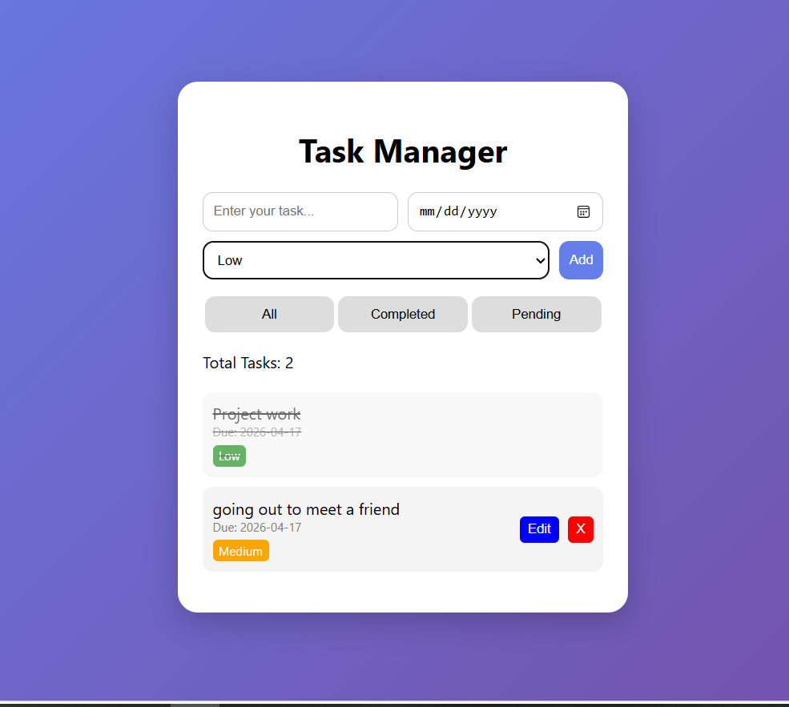

# Task Manager Web App

This is a simple and interactive Task Manager built using HTML, CSS, and JavaScript.

## Features
- Add, edit, delete tasks
- Mark tasks as completed
- Set due dates
- Priority levels (High, Medium, Low)
- Filter tasks (All / Completed / Pending)
- Data stored using localStorage

## Technologies Used
- HTML
- CSS
- JavaScript

## How to Run
1. Download files
2. Open index.html in browser
## Screenshot

